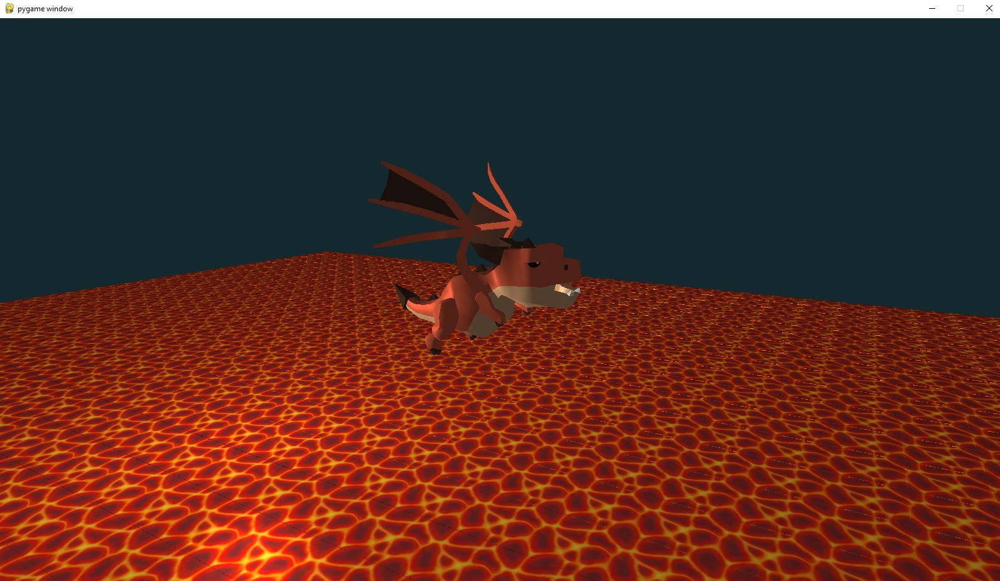

# Projeto Pygame 3D com ModernGL

Este projeto utiliza **Pygame**, **ModernGL**, **PyGLM** (biblioteca de matemática otimizada para gráficos 3D) e **pywavefront** (utilizada especialmente para gerenciar arquivos OBJ) para carregar e renderizar objetos 3D, como um dragão estilizado e um modelo de gato, utilizando OpenGL moderno.



## Instalação

Siga os passos abaixo para configurar e rodar o projeto.

### 1. Clonar o repositório

Primeiro, clone este repositório para sua máquina local:

```
git clone https://github.com/castagnagh/PyGame.git
cd PyGame
```

### 2. Instalar as dependências

Instale as seguintes bibliotecas Python necessárias para rodar o projeto. Utilize os comandos abaixo:


```
pip install pygame moderngl numpy

pip install PyGLM

pip install pywavefront 
```


### 3. Executar o projeto

Após a instalação das dependências, você pode rodar o projeto com o seguinte comando:

```
python main.py
```
Certifique-se de que todos os arquivos OBJ (objetos 3D) estejam no caminho correto dentro da pasta objects do projeto.

## ModernGL
O Modern OpenGL (OpenGL 3.0 e posteriores) trouxe uma grande reformulação no modo como os gráficos são renderizados, com foco em flexibilidade e maior controle da pipeline de renderização, em comparação com o OpenGL "antigo" (OpenGL 1.x e 2.x). Aqui estão as principais diferenças e conceitos fundamentais do Modern OpenGL:


### 1. Pipeline Programável vs. Pipeline Fixo

- OpenGL Antigo (Pipeline Fixo): Nas versões anteriores, o pipeline gráfico era fixo e mais simples. Isso significava que você tinha um conjunto limitado de operações pré-definidas para renderizar objetos. Funções como glBegin(), glEnd(), e glVertex() eram usadas para desenhar primitivas (triângulos, linhas, etc.) diretamente, e o controle sobre o processo de renderização era mais restrito.

- Modern OpenGL (Pipeline Programável): Em contraste, o Modern OpenGL introduziu um pipeline programável, onde você deve escrever shaders (pequenos programas que rodam na GPU) para controlar como os vértices e os pixels são processados. Isso dá muito mais flexibilidade e permite criar efeitos visuais personalizados.
### 2. Uso de Shaders
- OpenGL Antigo: Usava funções fixas para coisas como iluminação, transformação e mapeamento de texturas.
- Modern OpenGL: O Modern OpenGL depende quase inteiramente de shaders escritos em GLSL (OpenGL Shading Language). Existem principalmente dois tipos de shaders que você precisa fornecer:
    - Vertex Shader: Processa cada vértice e é responsável pela transformação de coordenadas (como a conversão de coordenadas do mundo para a tela) e outras operações no nível do vértice.
    - Fragment Shader: Processa fragmentos (potenciais pixels) e controla a cor e outros atributos de cada fragmento na tela.
- Há também Geometry Shaders e Tessellation Shaders, mas eles são menos usados em aplicações simples.

### 3. Buffers e VBOs
- OpenGL Antigo: As geometrias eram passadas diretamente nas funções de desenho (glVertex, glNormal, etc.), o que era relativamente ineficiente para renderização de grandes quantidades de dados.
- Modern OpenGL: Introduz Vertex Buffer Objects (VBOs), onde você armazena os dados dos vértices (coordenadas, cores, normais, etc.) diretamente na memória da GPU. O uso de buffers melhora muito o desempenho, já que os dados não precisam ser enviados repetidamente à GPU.

### 4. Vertex Array Objects (VAOs)
- No Modern OpenGL, você também usa Vertex Array Objects (VAOs) para armazenar a configuração dos VBOs. O VAO armazena informações sobre como os dados dos vértices estão organizados e quais atributos estão sendo usados. Isso facilita o processo de reutilização das configurações de buffer.

### 5. Transform Feedback e Instancing
- Modern OpenGL inclui recursos avançados como transform feedback, que permite capturar dados dos shaders para uso posterior, e instanced rendering, que permite desenhar várias instâncias de um objeto com uma única chamada de desenho.
### 6. Uniforms e Texturas
- Os Uniforms são variáveis passadas do seu código para os shaders, que permanecem constantes enquanto o shader é executado para vários vértices ou fragmentos. Por exemplo, você pode usar uniforms para passar a matriz de transformação ou a cor da luz para o shader.
- Texturas também são manipuladas diretamente nos shaders, permitindo maior flexibilidade na forma como os dados de textura são usados no processo de renderização.
### 7. Matrizes de Transformação e Projeção
- OpenGL Antigo: Utilizava funções fixas para lidar com transformações e projeções, como glMatrixMode() e glLoadIdentity(), que aplicavam automaticamente transformações de modelo, visualização e projeção.
- Modern OpenGL: Requer que você mesmo manipule as matrizes de transformação (geralmente usando bibliotecas externas, como GLM), e você precisa passar essas matrizes para os shaders através de uniforms.
### 8. Contexto de Compatibilidade vs. Contexto Core
- Contexto de Compatibilidade: No Modern OpenGL, ainda há suporte para muitas das funções antigas por meio de um "contexto de compatibilidade". Isso é útil para manter compatibilidade com código legado, mas não oferece as vantagens de desempenho e flexibilidade do pipeline programável.
- Contexto Core: O contexto "core" remove todas as funcionalidades antigas (pipeline fixo, chamadas imediatas, etc.) e força você a usar os novos métodos, como shaders e buffers. Ele é considerado o "caminho correto" para aplicações modernas.


## Referência
Este projeto foi desenvolvido com base no tutorial do canal Coder Space:

[Let's code 3D Engine in Python. OpenGL Pygame Tutorial](https://www.youtube.com/watch?v=eJDIsFJN4OQ&t=1s&ab_channel=CoderSpace)

Assista ao tutorial para aprender mais sobre o ModernGL e como ele é aplicado no Pygame.

Texto criado com auxilio do [GPT](https://chatgpt.com/)